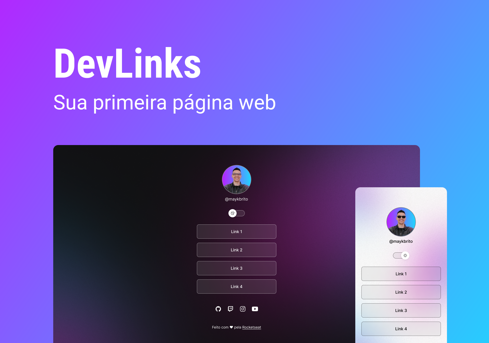

<h1 align="center"> Brazuna Dev </h1>

Responsive personal page to display and promote my links.

  <a href="#-technologies">Technologies</a>&nbsp;&nbsp;&nbsp;|&nbsp;&nbsp;&nbsp;
  <a href="#-project">Project</a>&nbsp;&nbsp;&nbsp;|&nbsp;&nbsp;&nbsp;
  <a href="#-layout">Layout</a>&nbsp;&nbsp;&nbsp;|&nbsp;&nbsp;&nbsp;
  <a href="#memo-license">License</a>

  

 

  

## 🚀 Technologies

This project was developed with the following technologies:

- HTML e CSS
- JavaScript
- Ionicons
- Git e Github
- Figma

## 💻 Project

Brazuna Dev is a link aggregator to use as an online business card.

- [Acesse o projeto finalizado, online](https://brazuna.vercel.app/)

## 🔖 Layout

You can preview the project layout through [DESSE LINK](https://www.figma.com/file/jSf5JSzAaO4o7yLze84rAK/DevLinks-(Community)?type=design&node-id=0-1&mode=design&t=ZChqqpuECMPyY5R6-0). It is necessary to have an account on [Figma](https://figma.com) to access it.

## :memo: License

This project is licensed under the MIT license.

__

Made with 💜 by Rocketseat, modified by Vanessa Brazuna
